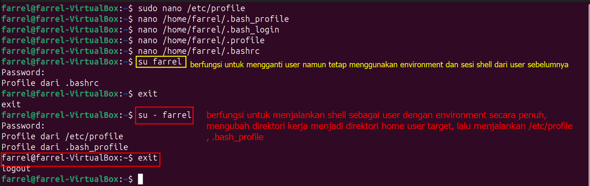
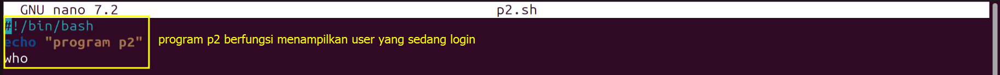

# Ahmad Farrel Aly
# 09011282328045
# SK3C
# Praktikum Sistem Operasi

1. Eksekusi seluruh profile yang ada :
a. Edit file profile /etc/profile dan tampilkan pesan sebagai berikut : echo “Profile dari /etc/profile” 
     

b. Asumsi nama anda stD02001, maka edit semua profile yang ada yaitu :
/home/stD02001/.bash_profile
/home/. stD02001/.bash_login
/home/mahasiswa/.profile
/home/mahasiswa/.bashrc
Ganti nama /home/mahasiswa dengan nama anda sendiri. Pada setiap file tersebut, cantumkan instruksi echo, misalnya pada /home/ mahasiswa/.bash_profile : echo “Profile dari .bash_profile” Lakukan hal yang sama untuk file lainnya, sesuaikan tampilan dengan nama file yang bersangkutan.    
# ############
  
# ############
  
# ############
  
# ############
c. Jalankan instruksi subtitute user, kemudian keluar dengan perintah exit sebagai berikut:
$ su mahasiswa
$ exit
kemudian gunakan opsi – sebagai berikut :
$ su – mahasiswa
$ exit
Jelaskan perbedaan kedua utilitas tersebut. 
# ############
2. Prompt String (PS) 
# ############
a. Edit file .bash_profile, ganti prompt PS1 dengan ‘>’. Instruksi export diperlukan dengan
parameter nama variable tersebut, agar perubahan variable PS1 dikenal oleh semua shell
PS1=‟> „
export PS1
# ############

b. Eksperimen hasil PS1 : $ PS1=“\! > “
69 > PS1=”\d > “
Mon Sep 23 > PS1=”\t > “
10:10:20 > PS1=”Saya=\u > “
Saya=mahasiswa > PS1=”\w >”
~ > PS1=\h >” 
# ############
3. Logout
Edit file .bash_logout, tampilkan pesan dan tahan selama 5 detik, sebelum eksekusi logout
Echo “Terima kasih atas sesi yang diberikan”
Sleep 5
clear 

# #############
4. Bash script
a. Buat 3 buah script p1.sh, p2.sh, p3.sh dengan isi masing-masing :
p1.sh
#! /bin/bash
echo “Program p1”
ls –l
p2.sh
#! /bin/bash
echo “Program p2”
who
p3.sh
#! /bin/bash
echo “Program p3”
ps x

###

###

###

###
b. Jalankan script tersebut sebagai berikut :
$ ./p1.sh ; ./p3.sh ; ./p2.sh
$ ./p1.sh &
$ ./p1.sh $ ./p2.sh & ./p3.sh &
$ ( ./p1.sh ; ./p3.sh ) & 

###

###

###

###

###

###
5. Jobs
### 
a. Buat shell-script yang melakukan loop dengan nama pwaktu.sh, setiap 10 detik, kemudian menyimpan tanggal dan jam pada file hasil. #!/bin/bash
while [ true ]
do
date >> hasil
sleep 10
done 

###
b. Jalankan sebagai background; kemudian jalankan satu program (utilitas find) di background
sebagai berikut :
$ jobs
$ find / -print > files 2>/dev/null &
$ jobs

###
c. Jadikan program ke 1 sebagai foreground, tekan ^Z dan kembalikan program tersebut ke
background
$ fg %1
$ bg

###
d. Stop program background dengan utilitas kil
$ ps x
$ kill [Nomor PID] 

###
6. History
###
a. Ganti nilai HISTSIZE dari 1000 menjadi 20
$ HISTSIZE=20
$ h

###
b. Gunakan fasilitas history dengan mengedit instruksi baris ke 5 dari instruksi yang terakhir
dilakukan
$ !-5

###
c. Ulangi instruksi yang terakhir. Gunakan juga ^P dan ^N untuk bernavigasi pada history bufer
$ !! 

###
d. Ulangi instruksi pada history bufer nomor 150
$ !150

###
e. Ulangi instruksi dengan prefix “ls”
$ !ls

